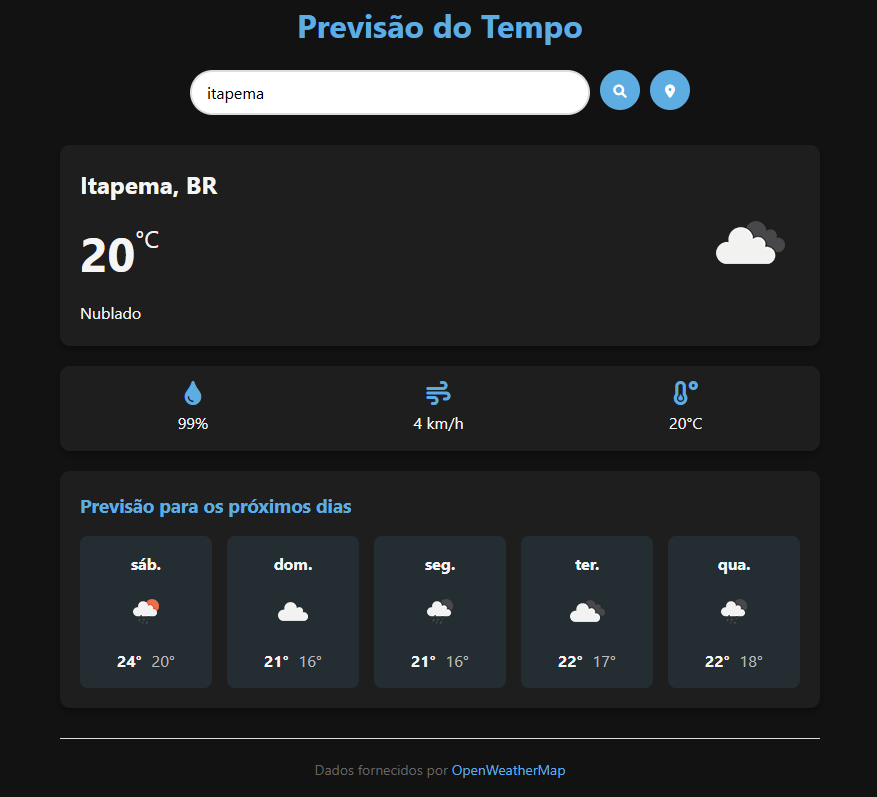

Aplicativo de Previsão do Tempo

Um aplicativo de previsão do tempo responsivo com temas claro/escuro, utilizando a API OpenWeatherMap.

 <!-- Adicione uma imagem real depois -->

## ✨ Funcionalidades

- ✅ Previsão do tempo em tempo real
- ✅ Previsão para 5 dias
- ✅ Busca por cidade ou geolocalização
- ✅ Tema claro/escuro automático
- ✅ Totalmente responsivo
- ✅ Exibe temperatura, umidade, vento e sensação térmica
- ✅ Ícones intuitivos para condições climáticas

## 🛠️ Tecnologias

- 
- 
- 
- 
